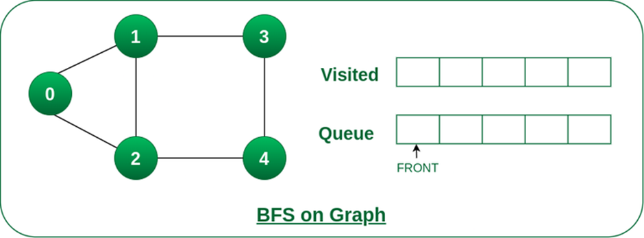
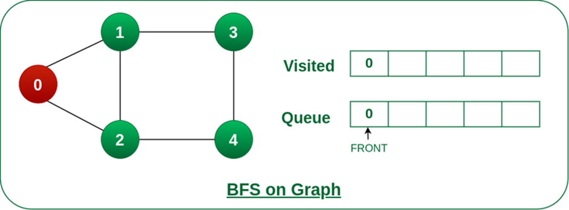
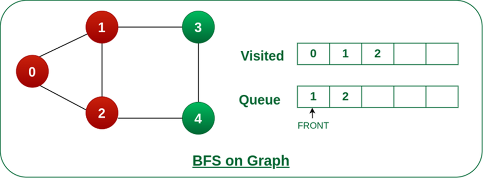
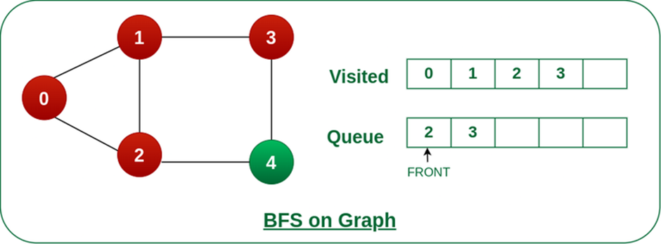
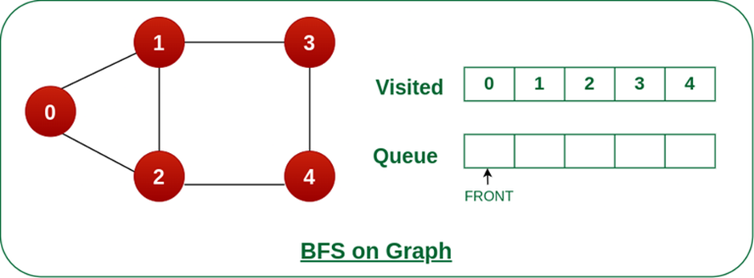
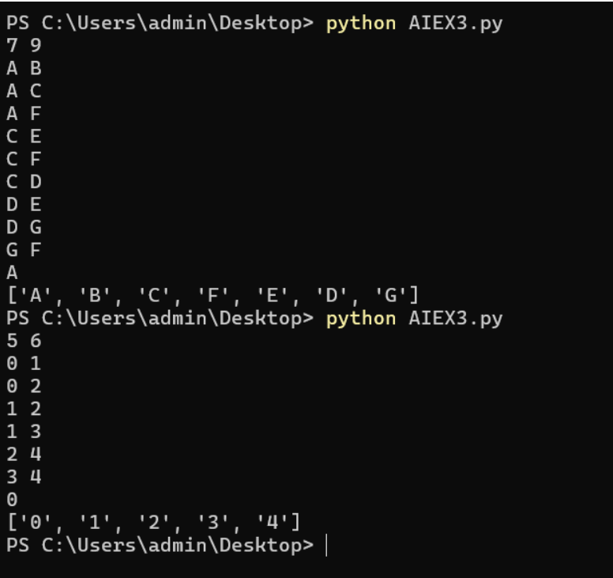

# BREADTH-FIRST-SEARCH
## ExpNo 3 : Implement Breadth First Search Traversal of a Graph 
## Name:  
PRAGATHI KUMAR
## Register Number:
212224230200
## Aim:
To Implement Breadth First Search Traversal of a Graph using Python 3.
## Theory:
```
Breadth-First Traversal (or Search) for a graph is like the Breadth-First Traversal of a tree.
The only catch here is that, unlike trees, graphs may contain cycles so that we may come to the same node again. To avoid processing a node more than once, we divide the vertices into two categories:
1.Visited
2.Not Visited

A Boolean visited array is used to mark the visited vertices. For simplicity, it is assumed that all vertices are reachable from the starting vertex. BFS uses a queue data structure for traversal.</p>
## How does BFS work?
  Starting from the root, all the nodes at a particular level are visited first, and then the next level nodes are traversed until all the nodes are visited.
To do this, a queue is used. All the adjacent unvisited nodes of the current level are pushed into the queue, and the current-level nodes are marked visited and popped from the queue.
Illustration:
Let us understand the working of the algorithm with the help of the following example.
```
## Step1: 
Initially queue and visited arrays are empty.

Queue and visited arrays are empty initially.
## Step2: 
Push node 0 into queue and mark it visited.

## Step 3: 
Remove node 0 from the front of queue and visit the unvisited neighbours and push them into queue.

## Step 4: 
Remove node 1 from the front of queue and visit the unvisited neighbours and push them into queue.


## Step 5: 
Remove node 2 from the front of queue and visit the unvisited neighbours and push them into queue.


## Step 6:
 Remove node 3 from the front of queue and visit the unvisited neighbours and push them into queue. 
As we can see that every neighbours of node 3 is visited, so move to the next node that are in the front of the queue.


## Steps 7: 
Remove node 4 from the front of queue and visit the unvisited neighbours and push them into queue. 
As we can see that every neighbours of node 4 are visited, so move to the next node that is in the front of the queue.



Remove node 4 from the front of queue and visit the unvisited neighbours and push them into queue.
Now, Queue becomes empty, So, terminate these process of iteration.

## Algorithm:
```
1.Construct a Graph with Nodes and Edges
2.Breadth First Uses Queue and iterates through the Queue for Traversal.
3.Insert a Start Node into the Queue.
4.Find its Successors Or neighbors and Check whether the node is visited or not.
5.If Not Visited, add it to the Queue. Else Continue.
6.Iterate steps 4 and 5 until all nodes get visited, and there are no more unvisited nodes.
```
## PROGRAM:
```
from collections import deque
from collections import defaultdict

V E
FOR EVERY EDGE
U V
7 9
A B
A C 
A F
C E
C F
C D
D E 
D G
G F

def bfs(graph,start,visited,path):
    queue = deque()
    path.append(start)
    queue.append(start)
    visited[start] = True
    while len(queue) != 0:
        tmpnode = queue.popleft()
        for neighbour in graph[tmpnode]:
            if visited[neighbour] == False:
                path.append(neighbour)
                queue.append(neighbour)
                visited[neighbour] = True
    return path

graph = defaultdict(list)
v,e = map(int,input().split())
for i in range(e):
    u,v = map(str,input().split())
    graph[u].append(v)
    graph[v].append(u)

start = input()
path = []
visited = defaultdict(bool)
traversedpath = bfs(graph,start,visited,path)
print(traversedpath)
```
## Sample Input:
```
7 9 
A B 
A C 
A F 
C E 
C F 
C D 
D E 
D G 
G F 
```
## Sample Output:
['A', 'B', 'C', 'F', 'E', 'D', 'G']

## Sample Input:
```
5 6 
0 1 
0 2 
1 2 
1 3 
2 4 
3 4
``` 
## Sample Output:

['0', '1', '2', '3', '4']
## output:

## Result:
Thus,a Graph was constructed and implementation of Breadth First Search for the same graph was done successfully.


